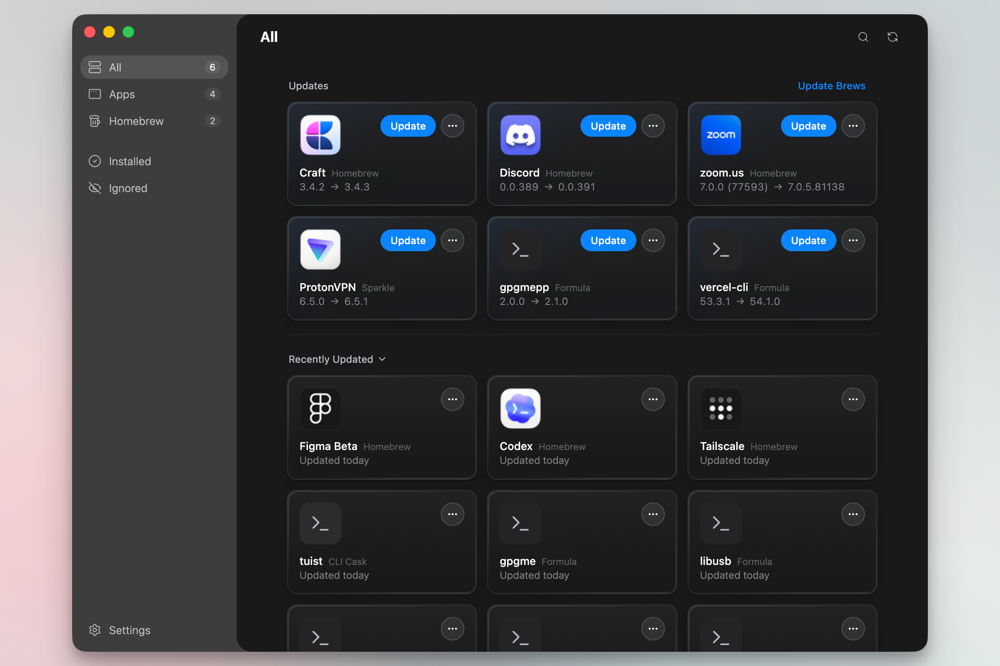
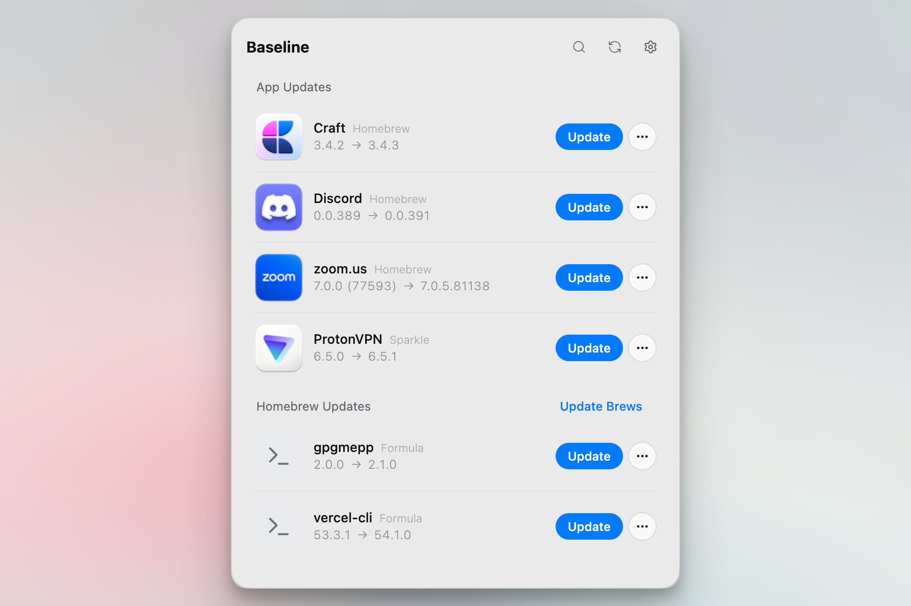
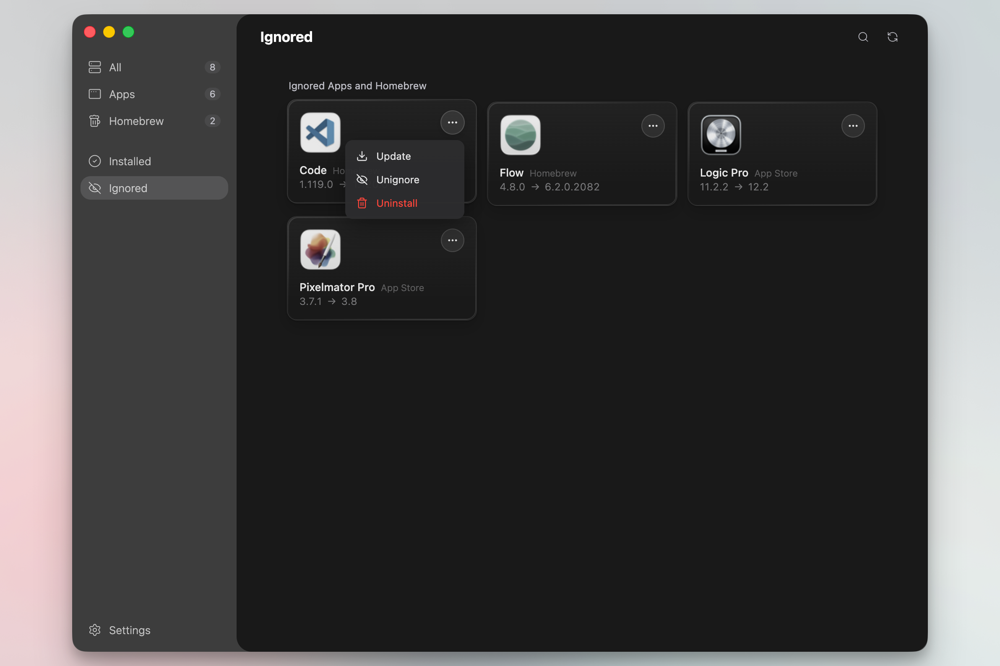
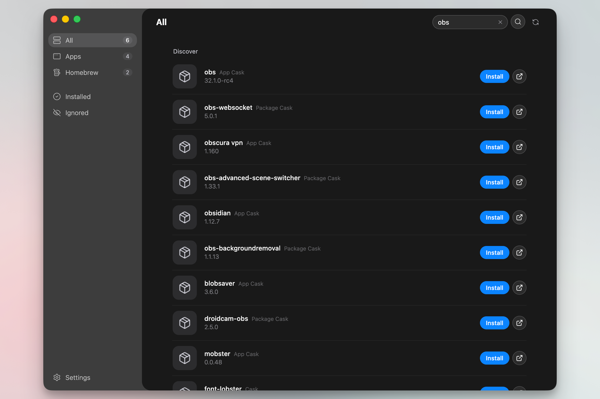

# Baseline

<p align="center">
  
  
  <a href="https://github.com/arshiaghaf/baseline/blob/main/LICENSE">
    
  </a>
</p>

Baseline helps you find and manage macOS app updates from public sources, including the App Store, Sparkle appcasts, and Homebrew.

It brings app updates, Homebrew updates, install discovery, ignored items, and fallback actions into one full app window and a compact menu bar tray.



## What Baseline Does

Baseline scans installed apps from system, user, and custom app directories, then checks public update sources for newer versions. It shows available updates, recently updated items, ignored items, and Homebrew discovery results without requiring a backend service or private API.

When direct local tooling is available, Baseline can run update and install actions through Homebrew or `mas`. When local tooling is unavailable, it provides external fallback links instead of guessing.

## Features

- Full app window plus compact menu bar tray for quick update checks
- Update detection from App Store lookup, Sparkle/DevMate appcasts, and Homebrew metadata
- Unified update views for apps, Homebrew casks, and Homebrew formulae
- Sidebar views for `All`, `Apps`, `Homebrew`, `Installed`, `Ignored`, and `Settings`

  

- Recently updated and ignored sections for keeping update lists manageable
- Ignore specific apps or Homebrew items so they stay out of the main update list
- Uninstall Homebrew-managed casks and formulae from item actions

  

- Search from the main window or menu bar tray to filter updates and discover installable Homebrew casks and formulae

  

- Auto refresh, refresh interval, custom scan directories, optional `mas`, and diagnostics controls in Settings
- External fallback links when local CLI tooling is unavailable

## Project Status

Baseline is functional beta macOS software. The core app experience works end to end, with ongoing polish focused on UI, packaging, and release quality.

Packaged unsigned DMGs are planned for the first public release.

## Install

No packaged release is available yet. Build Baseline from source for now.

Future unsigned DMG releases will be published on the [GitHub Releases](https://github.com/arshiaghaf/baseline/releases) page. Unsigned builds are not notarized by Apple, so macOS Gatekeeper may warn when opening them.

## Build From Source

Requirements:

- macOS
- Node.js 25 or newer
- npm

## Build And Test

```bash
npm ci
npm run typecheck
npm test
npm run build
npm run test:electron
```

Run the app during development:

```bash
npm start
```

## Limitations

- Update detection is best-effort and depends on public update sources exposed by installed apps, Apple lookup endpoints, and Homebrew metadata.
- Homebrew actions require Homebrew to be installed. Without it, Baseline opens external Homebrew or app pages instead.
- App Store update actions use optional local `mas` support when available. Without `mas`, Baseline opens the App Store page externally.
- Packaged releases are not signed or notarized yet.

## Release Tooling

For a fuller local release preview, run:

```bash
scripts/validate-preview.sh 0.0.0-preview
```

This builds, tests, packages an unsigned DMG, installs `/Applications/Baseline.app`, and smoke-launches the installed copy.

## Package An Unsigned DMG

```bash
scripts/create-unsigned-dmg.sh 0.1.0
```

The script builds a Release app, creates `dist/Baseline-0.1.0-unsigned.dmg`, and prints a SHA-256 checksum. See [docs/RELEASING.md](docs/RELEASING.md) for release steps and limitations.

To create the unsigned DMG plus release-note checksum text:

```bash
scripts/prepare-unsigned-release.sh 0.1.0
```

## Architecture

Baseline keeps update logic outside React views:

- `src/shared` defines domain contracts, persistence snapshots, security policy, and shared parsers.
- `src/main` contains Electron lifecycle, windows/tray, privileged IO, scanning, network lookup, subprocess execution, persistence, and IPC.
- `src/renderer` renders React state and dispatches user intents through the preload API.
- `ElectronTests` covers parsers, version logic, security checks, renderer behavior, persistence, store behavior, Homebrew app linking, and source-client fixtures.
- `e2e` covers Electron launch smoke tests.

See [docs/ARCHITECTURE.md](docs/ARCHITECTURE.md) for more detail.
See [docs/VALIDATION.md](docs/VALIDATION.md) for preview validation.

## Privacy And Security

Baseline uses public update pathways. It does not require private Apple frameworks, does not require a backend service, and does not require an API key.

The app may query public services such as Apple lookup endpoints, Sparkle/appcast URLs declared by installed apps, and Homebrew metadata endpoints. Homebrew and `mas` actions run locally when users choose those update paths.

Report suspected security issues using the process in [SECURITY.md](SECURITY.md).

## Contributing

Contributions are welcome. Start with [CONTRIBUTING.md](CONTRIBUTING.md), follow the pull request template, and run the validation commands before opening a PR.

## License

Baseline is licensed as `GPL-3.0-only`. See [LICENSE](LICENSE) for the full
GNU General Public License v3.0 text.

Copyright (C) 2026 Arshia Ghaffarian. Modified versions that are distributed
must remain licensed under the GPL, including the corresponding source code and
notices required by the license.
