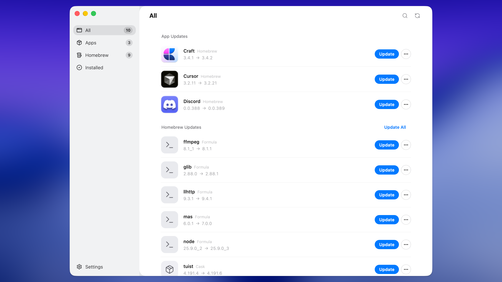
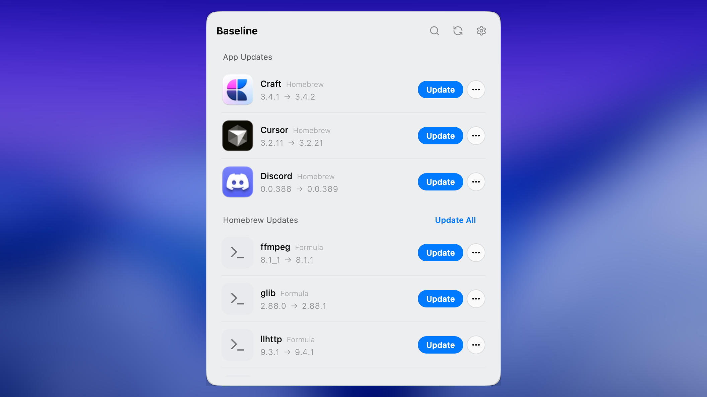
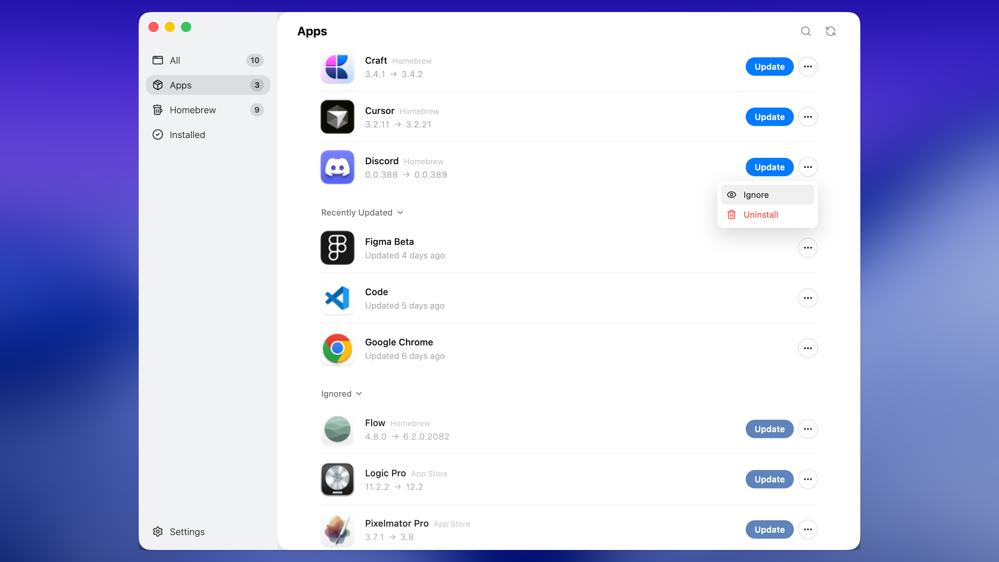
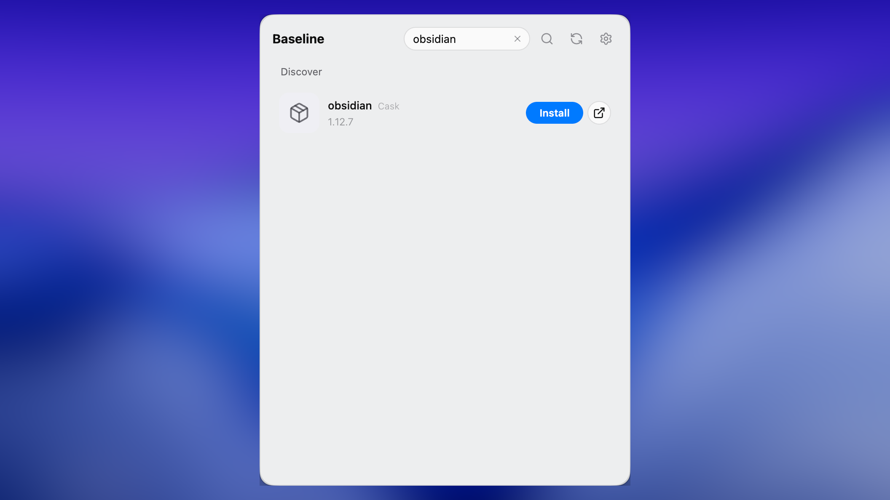

# Baseline

Baseline is a standalone macOS Electron app for finding app updates through public update sources.

It scans installed apps, checks App Store, Sparkle/DevMate appcast, and Homebrew metadata, then shows update actions in a full app window and a compact menu bar tray window.



## Project Status

Baseline is early-stage macOS software. The core update-checking flow is functional, but the UI and packaging/release process are still evolving.

Unsigned builds are not notarized by Apple. macOS Gatekeeper may warn when opening them. If you are not comfortable with unsigned preview software, build from source or wait for a signed release path.

## Features

- Full Electron app window plus compact menu bar tray window
- Installed app scanning from system, user, and custom app directories
- Update detection through:
  - App Store lookup API
  - Sparkle/DevMate appcasts
  - Homebrew cask and formula metadata
- Unified update lists for apps, Homebrew casks, and Homebrew formulae

  

- Dedicated `Apps`, `Homebrew`, and `Installed` views in the full app

- Recently updated and ignored sections for keeping update lists manageable
- Ignore specific apps or Homebrew items so they stay out of the main update list
- Uninstall Homebrew-managed casks and formulae from the row actions menu

  

- Search from the main window or menu bar tray to filter updates and discover installable Homebrew casks and formulae

  

- Best-effort App Store updates through `mas upgrade <appId>` when `mas` is installed
- Homebrew-managed inventory and update actions for installed casks and formulae when Homebrew is installed
- Search-driven Homebrew discovery:
  - Search installable casks and formulae
  - Install casks with `brew install --cask <token>` when `brew` is installed
  - Install formulae with `brew install <token>` when `brew` is installed
- External fallback links when local CLI tooling is unavailable

## Download

Preview builds are published on the GitHub Releases page as unsigned DMGs.

For each release:
- Download `Baseline-<version>-unsigned.dmg`.
- Verify the published SHA-256 checksum.
- Drag `Baseline.app` to `/Applications`.

Because the app is unsigned, macOS may show an unidentified-developer warning. This is expected for preview builds without an Apple Developer account.

## Build From Source

Requirements:
- macOS
- Node.js 25 or newer
- npm

## Build And Test

```bash
npm ci
npm run typecheck
npm test
npm run build
npm run test:electron
```

Run the app during development:

```bash
npm start
```

For a fuller preview handoff, run:

```bash
scripts/validate-preview.sh 0.0.0-preview
```

This builds, tests, packages an unsigned DMG, installs `/Applications/Baseline.app`, and smoke-launches the installed copy.

## Package An Unsigned DMG

```bash
scripts/create-unsigned-dmg.sh 0.1.0
```

The script builds a Release app, creates `dist/Baseline-0.1.0-unsigned.dmg`, and prints a SHA-256 checksum. See [docs/RELEASING.md](docs/RELEASING.md) for release steps and limitations.

To create the unsigned DMG plus release-note checksum text:

```bash
scripts/prepare-unsigned-release.sh 0.1.0
```

## Optional Local Tooling

- `mas` is optional. Without it, Baseline opens the App Store page externally instead of running `mas upgrade`.
- Homebrew (`brew`) is optional. Without it, Baseline opens external Homebrew/app pages instead of running install/upgrade actions.

## Architecture

Baseline keeps update logic outside React views:

- `src/shared` defines domain contracts, persistence snapshots, security policy, and shared parsers.
- `src/main` contains Electron lifecycle, privileged IO, scanning, network lookup, subprocess execution, persistence, and IPC.
- `src/renderer` renders React state and dispatches user intents through the preload API.
- `ElectronTests` covers parsers, version logic, security checks, renderer behavior, persistence, store behavior, and source-client fixtures.
- `e2e` covers Electron launch smoke tests.

The legacy Swift/Tuist source remains in the repository during the migration as a behavior reference until Electron parity is fully reviewed.

See [docs/ARCHITECTURE.md](docs/ARCHITECTURE.md) for more detail.
See [docs/VALIDATION.md](docs/VALIDATION.md) for preview validation.

## Privacy And Security

Baseline uses public update pathways. It does not require private Apple frameworks, does not require a backend service, and does not require an API key.

The app may query public services such as Apple lookup endpoints, Sparkle/appcast URLs declared by installed apps, and Homebrew metadata endpoints. Homebrew and `mas` actions run locally when users choose those update paths.

Report suspected security issues using the process in [SECURITY.md](SECURITY.md).

## Contributing

Contributions are welcome. Start with [CONTRIBUTING.md](CONTRIBUTING.md), follow the pull request template, and run the validation commands before opening a PR.

## License

Baseline is licensed under the GNU General Public License v3.0. See [LICENSE](LICENSE).
